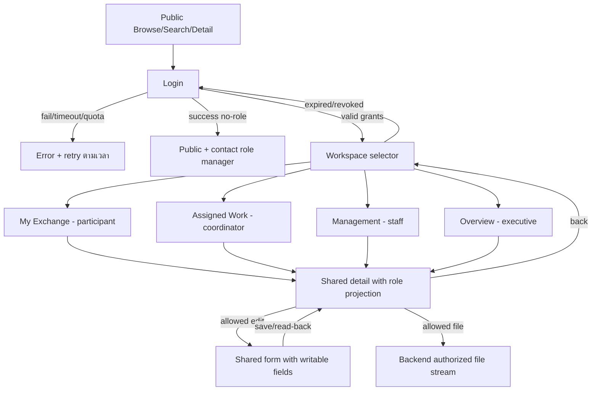

# API contracts and page flows — #92

**V3-B1 · proposed routes ไม่ใช่ endpoints ที่ deploy แล้ว** · [สารบัญ](README.md)

## Contract กลาง

Base `/api`; JSON UTF-8, authenticated cookie ตาม [Session](authentication-session.md) ทุก response protected `Cache-Control: no-store` ทุก mutation ต้อง Origin + `X-CSRF-Token` และ body allowlist Field ที่ไม่รู้จัก/server-owned หรือไม่มีสิทธิ์ส่ง → 422/403 ไม่ silently apply

สำเร็จ single `{data:{...},requestId}`, list `{data:[],page:{limit,nextCursor},count,requestId}`, error `{error:{code,message,fields?},requestId}`; auth ใช้ shape `{user,grants,capabilities,csrfToken}` ที่ Session design ระบุ count คำนวณหลัง authorization + filters เป็นจำนวนทั้งหมดที่ตรงเงื่อนไขภายใน scope ไม่ใช่ยอด global cursor เป็น opaque ผูก filters/user/scope/version, limit default20/max100

Mutation create 201, update/status 200; GET 200; logout 204; 400 query/body malformed, 401 missing/expired/revoked Session, 403 action/CSRF denied, 404 record/file นอก scope หรือไม่พบ (ข้อความเดียวกัน), 409 version/transition conflict, 413 file ใหญ่, 415 MIME ไม่รองรับ, 422 invalid fields/refs/date, 429 limit, 502 bad provider response, 503 unavailable/config ไม่พร้อม หาก dependency ล้มเหลวห้ามคืน empty success

Create ใช้ `Idempotency-Key` random client request ID เก็บ per user/route 24h: replay payload เดิมคืน result เดิม, key เดิมคนละ payload →409; PATCH/status ใช้ `If-Match` เทียบ `version` required (ขาด →428) conditional write ป้องกัน lost update

Authorization pipeline: Session validity → active user/authzVersion → matching role grant + scope → record responsibility/participant → field permissions → validate refs/transition → conditional write/read projection; write transaction ต้อง recheck authzVersion/record version และ assignment ณ commit กันการถอนสิทธิ์ระหว่าง request; list/search/count ต้องจำกัดสิทธิ์ก่อน aggregate/paginate ไม่ fetch global list แล้วซ่อนใน UI

## Public contract และ V2 compatibility

`GET /api/public/partners`, `/partners/{id}`, `/activities`, `/activities/{id}` ไม่ต้อง Login ไม่มี documents/contacts/participants/ownership endpoint สาธารณะ

| Query | Meaning |
| --- | --- |
| `q` ≤200 chars | trim/case-insensitive substring เฉพาะ partner name/activity title |
| `type` | enum ตาม entity; invalid →422 ไม่ silently ignore |
| `startDate/endDate` | ISO วันจริง inclusive; reversed →422; activity.periodDate อยู่ในทั้งสอง bounds; partner มี public activity เดียวที่ผ่านทั้งสอง bounds |
| `limit/cursor` | pagination ข้างต้น; count ภายใน public projection/filter เท่านั้น |

Public field allowlist: Partner `id,name,type,summary,full_description,location,website_url,logo_path`; Activity `id,title,type,summary,full_description,partnerId,partnerName,period,period_date,image_path,co_hosts,visibility` โดย co_hosts/partnerName ประกอบจาก public partners ที่เชื่อม valid และผ่าน public display projection แล้ว คง field naming เดิมใน public adapter เพื่อลด regression ไม่คืน raw v3 objects

Public activity ต้องมี public primary partner; internal/orphan primary partner ไม่ถูก export และต้องมี validation report ก่อน cutover การ publish ต้องตรวจข้อความ/รูปที่เลือกเผยแพร่ด้วย allowlist ชื่อ field อย่างเดียวไม่รับรองว่าเนื้อหาปลอดข้อมูลส่วนบุคคล

คง `/default/fetchPartnersData` สำหรับ V2 จน frontend adapter ใหม่ผ่าน regression; compatibility response เป็น flat array แบบเดิมและ publication flags คงไว้เพื่อ loader เดิม แต่ field allowlist เดียวกัน ไม่มี contacts/responsible IDs หรือ internal links backup export ใช้ compatibility projection เดียวกัน; public requests error ใช้ backup ได้พร้อม notice, protected requests ห้าม fallback

ตัวอย่าง public vs internal (synthetic):

```json
{"publicPartner":{"id":"p1","name":"Demo Partner","type":"university","summary":"Public description","location":"Bangkok","website_url":"","logo_path":""},"internalPartner":{"id":"p1","name":"Demo Partner","scopeId":"cs-demo","responsibleUserIds":["u3"],"publication":"public","version":2}}
```

Public response ไม่รวม internalPartner แม้อยู่ record เดียวกัน Student exchange projection คืนเฉพาะ `id,title,partners,startDate,endDate,status,supportingInfoForParticipant,documents` ที่อนุญาต ไม่คืน participants อื่น/internal notes Executive projection ไม่มี contact email/phone, user IDs หรือ personal documents

## Auth / roles

| Method / Path | Input | Response / Permission |
| --- | --- | --- |
| GET `/auth/session` | — | user หรือ null, grants/capabilities ของตน, CSRF; anonymous session ตาม #90 |
| POST `/auth/login` | `{username,password}`; username 1–128, password 1–512 chars ไม่ trim password | #90 auth response; key/TU raw response ไม่ออก frontend |
| POST `/auth/logout` | `{}` | revoke/expire; 204 |
| GET `/users?scopeId=&q=` | verified active users minimal identity | role-manager ใน managedScopeIds หรือ staff curriculum หรือ coordinator เมื่อจำเป็นต่อ assigned exchange participant selection; no global user search; coordinator ต้องส่ง `exchangeId` ของ assigned exchange และ scope เดียวกัน; ไม่รับเพียง scope เพื่อ enumerate ทั้งหลักสูตร |
| GET `/role-grants?scopeId=` | — | manageRoles ใน managed scope เท่านั้น; role grants ไม่ใช่ public user directory |
| POST `/role-grants` | `{userId,role,scopeId}` | manageRoles ใน managed scope; target verified; self-change denied |
| PATCH `/role-grants/{id}` | `{active:false}` | manageRoles; revoke + increment authzVersion; no self/capability edits |

## Business endpoints

ทุก `/partners`, `/activities`, `/agreements`, `/exchanges` เป็น protected routes; list/detail/projection ใช้ [Matrix](scope-permissions.md) Create เป็น staff ยกเว้น coordinator สร้าง activity/agreement/exchange ใน grant scope โดย server assign ตนเอง; scopeId ส่งเฉพาะ create และต้องอยู่ grant scope Update scope/createdBy ไม่ได้

| Routes | Input / Allowlist / Validation | Permission / Output |
| --- | --- | --- |
| GET `/partners`, `/partners/{id}`; POST `/partners`; PATCH `/partners/{id}` | name,type,summary,fullDescription,location,websiteUrl,logoPath; staff เพิ่ม publication/responsibleUserIds ได้; coordinator assigned แก้ display fields ได้เฉพาะ internal partner | Matrix ตาม resource; 201 create / 200 read-update |
| GET/POST `/partners/{id}/contacts`; PATCH `/partners/{id}/contacts/{contactId}` | name,position,email,phone; coordinator assigned/staff; parent scope check; contact มี personal projection ไม่ให้ executive | Matrix ตาม resource; 201 create / 200 read-update |
| GET/POST `/partners/{id}/history`; PATCH `/partners/{id}/history/{historyId}` | occurredOn,kind,note,referenceType,referenceId; author/time server generated; same parent scope/permission, history version check | Matrix ตาม resource; 201 create / 200 read-update |
| GET `/activities`, `/activities/{id}`; POST `/activities`; PATCH `/activities/{id}` | title,type,summary,fullDescription,partnerId,coHostPartnerIds,agreementIds,periodText,periodDate,imagePath; staff เพิ่ม publication/responsibleUserIds ได้; refs อยู่ scope และผู้เรียกเข้าถึงได้ | Matrix ตาม resource; 201 create / 200 read-update |
| GET `/agreements`, `/agreements/{id}`; POST `/agreements`; PATCH `/agreements/{id}` | title,agreementType,partnerIds,startDate,endDate,renewalDueOn,renewalNote,internalNote; staff เพิ่ม `responsibleUserIds`; create status=draft เสมอ | Matrix ตาม resource; 201 create / 200 read-update |
| POST `/agreements/{id}/status` | `{to,reason?,endDate?,renewalNote?}` + If-Match | transition ตาม #91; renewal ให้ส่ง endDate ใหม่ atomic กับ transition |
| GET `/exchanges`, `/exchanges/{id}`; POST `/exchanges`; PATCH `/exchanges/{id}` | title,partnerIds,agreementId,participantUserIds,startDate,endDate,supportingInfo,supportingInfoForParticipant; staff เพิ่ม `responsibleUserIds`; coordinator assigned เปลี่ยน participants ได้หลัง validate student scope; status draft on create | Matrix ตาม resource; 201 create / 200 read-update |
| POST `/exchanges/{id}/status` | `{to,reason?,supportingInfo?}` + If-Match | transition ตาม #91; student/executive denied |
| GET `/me/exchanges`, `/me/exchanges/{id}` | q,status,startDate,endDate,limit,cursor; `type` unsupported →422 | student grant + participant intersection; ใช้ participant projection |
| GET `/overview` | scopeId,entityType,status?,startDate?,endDate? | executive/staff ตาม grant; aggregate non-personal authorized records; ไม่คืนรายชื่อ participant |

Protected list query: `q` name/title, type เฉพาะ partner/activity, status เฉพาะ agreement/exchange, dates ตาม activity day หรือ **interval overlap** สำหรับ agreement/exchange (`record.startDate ≤ query.endDate` และ `record.endDate ≥ query.startDate` เมื่อ bound นั้นมี) records ขาดวันที่ไม่ผ่านเมื่อมี date filter; อย่านำ rule public partner/activity ไปใช้กับ agreement interval โดยไม่เปลี่ยน contract Unsupported query →422

## Documents

| Method / Path | Contract |
| --- | --- |
| GET `/{agreements\|exchanges}/{id}/documents` | filtered metadata ของ parent ที่มีสิทธิ์; student ใช้ `/me/exchanges/{id}/documents`; ไม่คืน objectKey |
| POST `/{agreements\|exchanges}/{id}/documents` | multipart file + displayName/audience/containsPersonal; coordinator assigned/staff; Parent If-Match ไม่ใช้ Document create ใช้ Idempotency-Key |
| GET `/documents/{id}` | metadata เมื่อ parent+audience ผ่าน; pending/rejected ไม่ให้ download |
| GET `/documents/{id}/content?disposition=inline\|attachment` | authorize Session/grants/parent/audience ใหม่ทุกครั้ง แล้ว stream; 404 ถ้าไม่มีสิทธิ์; ไม่คืน public URL |

PDF/JPEG/PNG สูงสุด **10 MiB**, ตรวจ signature/MIME/extension, random objectKey, sanitize filename, reject SVG/HTML/executable, upload pending → ready หลัง validation; failure → rejected ไม่ link เป็น ready content `Content-Type` ที่ตรวจแล้ว + `X-Content-Type-Options:nosniff` + safe Content-Disposition; deployment ต้องรองรับ upload/download size นี้ ถ้า gateway limit ต่ำกว่าให้ปรับผ่าน ADR หรือ reject ก่อนรับ body ไม่แอบตัดไฟล์

Private files encrypted at rest, public access blocked, backend service identity เท่านั้น; student upload denied; containsPersonal document ต้อง exchange/participants Executive ขอ file ของ participant →404 ไม่เห็น metadata ด้วย Permission change/session expiry ระหว่าง stream ไม่เรียกคืน bytes ที่ส่งแล้ว แต่ request ถัดไปต้อง deny

## Page flows



แต่ละ workspace เก็บ query/type/status/date/cursor ใน URL ของ workspace; back จาก detail คืน filters เดิม ไม่เก็บ protected data/credentials ใน URL หรือ localStorage Form อ่าน permission จาก server response เพื่อแสดง controls แต่ backend ตรวจซ้ำทุก action; no-role แยกจาก expired (401), forbidden (403) และ record ไม่พบ/นอก scope (404)

List/detail/form มี loading, empty, failed+retry, saving+disable double submit และ conflict+reload controls; 401 clear cached protected state แล้ว Login พร้อม safe return path; 403 ไม่ auto retry; error ไม่ render provider stack และไม่แทนด้วยข้อมูล public backup

## Contract test cases ที่ frontend/backend ใช้ร่วมกัน

| ID | Input / Expected |
| --- | --- |
| A01 | anonymous GET public →200 allowlist; GET protected →401 |
| A02 | no-role Session →200 session/grants=[]; protected list →403 |
| A03 | student participant GET E1 →200 minimal projection; E2 ID tamper →404; PATCH/upload E1 →403 |
| A04 | coordinator assigned PATCH valid →200/version+1/read-back; other record →404; responsibility/publication injection →403 |
| A05 | staff scope C1 POST/PATCH valid →201/200; scope C2/ref C2 or unverified participant →404/422 without reference details |
| A06 | executive GET scoped overview →200 no personal fields; POST/PATCH →403; personal doc →404 |
| A07 | revoke grant/authzVersion during Session →next request401; fresh Login still no removed grant |
| A08 | missing Origin/CSRF on write →403 before side effect; stale If-Match→409; repeated Idempotency-Key same body →same result |
| A09 | keyword+type+date →intersection and scoped count; unknown enum/reversed range→422; public related count ไม่รวม internal records |
| A10 | pending/rejected/other-owner document/expired Session →deny; allowed ready file →stream no public URL |
| A11 | invalid TU body/status/key/timeout/quota →#90 errors without authenticated Session |
| A12 | legacy missing owner →public allowlist ยังอ่านได้; protected coordinator/student access denied; staff remediation within scope only |

นี่คือ acceptance specifications ยังไม่มี V3 server/route implementation หรือผล runtime tests ในงานออกแบบนี้
