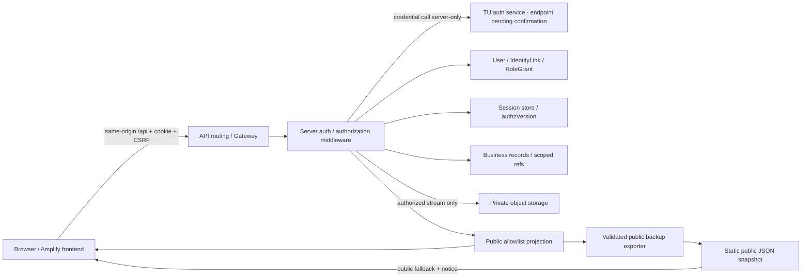

# Architecture decisions and V2 migration — #93

**V3-B1 · proposed design, ไม่มี AWS changes** · [สารบัญ](README.md)

## Current → target

V2 source ที่ตรวจ: static frontend ใน `public/`, Amplify config, public API URL, backup workflow และ old migration script; ไม่มี Lambda source/IaC ใน repo นี้ การตอบ 500 ณ #88 ไม่พิสูจน์สาเหตุ Lab/IAM/table; ต้องตรวจ AWS แยกก่อน runtime work

Logical boundaries ไม่ได้หมายความว่าต้องมี Lambda/table ใหม่ทุกกล่อง; เลือก physical layout หลังอ่าน backend จริง Backend credentials/key อยู่ secret configuration ไม่ผ่าน frontend/git/backup/logs

## ADR-B1: identity และ Session

Decision: ใช้ local UUID + verified TU link และ opaque cookie Session ตาม [#90](authentication-session.md) ยืนยัน grants/version ทุก request และ rotate token เมื่อ Login; trade-off เป็น store lookup เพิ่มเพื่อ revoke ได้ชัดเจน JWT ลด lookup บางส่วนแต่ต้องออกแบบ revocation/claims freshness; SSO redirect ยังไม่มี provider evidence จึงไม่เลือก

Session store จะใช้ DynamoDB เป็น candidate ตาม stack เดิม แต่ implementation ต้องกำหนด key, consistent read/transaction สำหรับ user/version/grant updates และ benchmark ค่าใช้จ่าย/latencyก่อนรับ หากอ่านข้อมูล authz แบบ eventually consistent แล้วทำให้ revoke ยังใช้ได้ ถือว่าไม่ผ่าน contract TTL ใช้ cleanup เท่านั้น ต้องตรวจ deadline ในโค้ดด้วย ดู [AWS consistency](https://docs.aws.amazon.com/amazondynamodb/latest/developerguide/HowItWorks.ReadConsistency.html) และ [AWS TTL](https://docs.aws.amazon.com/amazondynamodb/latest/developerguide/TTL.html); GSI ไม่รองรับ strongly consistent read จึงห้ามพึ่ง GSI เพียงอย่างเดียวตัดสิน role withdrawal; list candidates จาก index ต้อง revalidate current record permission ก่อน response/count

## ADR-B2: data และ API boundary

Decision: คง Partner/Activity IDs และ public DTO/backup shape เดิมผ่าน adapter; เพิ่ม User/Identity/Role/Agreement/Exchange/Document entities ฝั่ง server schemaVersion=3 ใช้ scope filters ก่อน count/pagination; ห้าม frontend อ่าน database ด้วย AWS credentials

ตัวเลือก: ขยาย DynamoDB เดิมแบบ entity discriminator + indexes, หรือแยกตาราง auth/business, หรือ relational database ทางเลือกแรก/สองลดการย้าย stack แต่ต้องกำหนด access patterns/transaction/index และ Lambda permissions; relational ช่วย constraints/joins แต่เพิ่ม migration และ connection operations **ยังไม่เลือก table topology หรือ library ใหม่แทนทีม** Candidate minimum คือใช้บริการเดิมพร้อมแยก auth/export permissions และ access paths ตาม entity/scope/user; ห้าม full-scan แล้วส่ง protected data ให้ browser กรองเอง

ค่าใช้จ่ายเพิ่มจาก auth reads/writes, sessions, object storage, streaming egress และ logs; ยังไม่มี workload/account cost evidence จึงไม่ใส่ตัวเลขราคา ไม่มีการจัดซื้อ/เปิดบริการในงานนี้

## ADR-B3: private documents

Decision: private object storage + backend authorize metadata/content ทุกครั้งและ stream; S3 เป็น candidate ที่สอดคล้อง AWS เดิม เปิด block-public-access, encryption, least-privilege service role และ random object keys ตาม implementation review ไม่มี public bucket/URL ใน response

เปรียบเทียบ: เก็บไฟล์ใน repo/public/backup ทำให้ authorization ใช้ไม่ได้จึงไม่เลือก; short-lived presigned URLs ลด backend bandwidth แต่ URL ที่ออกแล้วอาจใช้ต่อจนหมดอายุ/เงื่อนไข credentials เปลี่ยน จึงไม่เลือกเป็น baseline ที่ต้องตรวจสิทธิ์ทุก download อ่านข้อจำกัดจาก [AWS presigned URL documentation](https://docs.aws.amazon.com/AmazonS3/latest/userguide/using-presigned-url.html) ไม่อ้างว่าถอนลิงก์ได้ทันที

Streaming ต้องพิสูจน์ Lambda/Gateway/hosting size/time limits รองรับ PDF/JPEG/PNG **10 MiB** และไม่มี untrusted inline active content หาก stack รองรับไม่ได้ ให้ปรับ ADR/limit ก่อน implement ไม่รับปากว่า route ปัจจุบัน stream ได้แล้ว request ที่เริ่มส่ง bytes ไปก่อน revoke เรียกกลับไม่ได้; request ใหม่ต้อง check เสมอ

## ADR-B4: deployment และ Lab availability

Decision: คง Amplify frontend และ AWS API-first เป็น baseline, ต้องมี same-origin `/api` routing สำหรับ cookie design ค่อยพิสูจน์วิธี routing/custom domain กับ deployment จริง ไม่มีการสมมติว่า Amplify reverse proxy รองรับ protected cookies ตามต้องการโดยอัตโนมัติ หากทำไม่ได้ให้ทบทวน #90/#92 พร้อม CORS/CSRF tests

Public fallback ช่วย read-only availability เมื่อ Lab/API ไม่พร้อม แต่ไม่ทำให้ Login/write/private document ใช้ offline ได้ Protected API unavailable →error ไม่มีข้อมูล protected ใน static backup ข้อมูล public ใช้ manual backup + reload จนทีมเลือกระบบ freshness อื่น

## Migration mapping

Source ที่ตรวจได้คือ repository backup ไม่ใช่ export ฐานข้อมูลล่าสุด ต้องมี authorized DB export จริงก่อนย้าย และต้องแก้ API readiness ถ้าจะใช้ API เป็น source

| Source | Target mapping | Safe default / ห้ามเดา |
| --- | --- | --- |
| partner id/name/type/summary/location/url/logo/full_description | Partner stable id, camelCase internal fields; public adapter แปลงกลับ | คง full description ที่อนุญาตเผยแพร่; type internship ที่มีจริงห้ามทิ้ง |
| partner coordinators เป็นชื่อ | Contact legacy name ใน scope ที่ยืนยัน | ไม่สร้าง User/grant/identity link จากชื่อ/email; responsibility=[] |
| activity id/title/type/summary/full_description/period/period_date | Activity id เดิม, periodText/periodDate | date missing→null; ไม่ parse ข้อความปีไปเป็นวันโดยเดา |
| partnerId และ partnerName | partnerId เป็น authority; display name อ่านจาก Partner | missing ref→quarantine; ไม่สร้าง partner จากข้อความชื่อเอง |
| co_hosts names | coHostPartnerIds หลังตรวจ mapping; preserve legacyCoHostNames internal | substring match ใช้เสนอ candidate เท่านั้น; ambiguity→manual review; public relation regression ต้องผ่านก่อน cutover |
| access_level/visibility | publication ตาม rule ด้านล่าง | absent/unknown/conflicting→internal/quarantine; ห้าม OR flags ที่ขัดกัน |
| ไม่มี scope/user/time/version | scopeId จาก deployment owner, createdBy/updatedBy=null, migration timestamps, version=1, schemaVersion=3 | scope ไม่ทราบ→หยุด; imported responsible=[] ได้แต่ไม่มี assigned access |
| ไม่มี Agreement/Exchange/Document | ไม่มี target record จนมี source ที่ยืนยัน | ไม่สร้าง agreement จาก activity.type หรือชื่อ; import เพิ่มภายหลังใช้ draft/dates=null และ validate refs |

Publication normalization: partner/activity ที่เดิมมี explicit public flag อย่างน้อยหนึ่งตัวและ **ไม่มีอีก flag ที่ explicit non-public** →eligible public; ต้องผ่าน field projection ก่อน publish ไม่มี flags→internal; flags ขัดกัน→quarantine ทั้งจำนวนและ ID ของ quarantine ต้องรายงาน ห้าม drop เงียบ

Public field allowlist ใน [API](api-flows.md) ใช้กับ exporter/API/bundle เดียวกัน Contact names/phone/email และ owner/user/participants/document objectKey ไม่อยู่ใน allowlist ถึง legacy file เคยมี coordinators ก็ไม่คัดลอกเข้า public export ใหม่ การเปลี่ยนนี้ต้องประกาศใน migration report แต่ UI ปัจจุบันไม่ได้อ่าน coordinators ตาม source ที่ตรวจ

## Runbook: backup → dry run → cutover → validate

1. **Freeze/source:** ระบุ target environment, ผู้รับผิดชอบ, source export timestamp/hash และ frontend/backend versions; หยุด writes ช่วง cutover หรือมี delta plan ที่ตรวจได้ ขาดข้อมูล/สิทธิ์/rollback owner ให้หยุด ไม่ใช้ production เป็นที่ทดลอง
2. **Backup:** export DB/metadata พร้อม version + snapshot และสำรอง private objects/config references ตามสิทธิ์ที่อนุญาต เก็บ encrypted ใน restricted location ไม่ commit dump/credentials/personal data ลง git ทดลองอ่านสำเนาและ restore ใน environment ทดสอบก่อน
3. **Dry run:** transform ไป destination สำเนา/namespace ใหม่ ไม่ overwrite V2; สร้าง ID mapping, duplicate/orphan/conflict/unresolved/field-removal report เปรียบเทียบกับ [inventory](legacy-inventory.json) เฉพาะเพื่อ baseline ไม่สรุปจำนวน production ว่าต้องเท่ากันถ้าข้อมูลเปลี่ยน
4. **Validate data:** source IDs เท่ากับ migrated+quarantined IDs, ไม่ซ้ำ/ไม่หาย, count ต่อ entity, primary/co-host/agreement/participant refs และ scope ถูกต้อง, unknowns ไม่กลายเป็น permission, state/date rules ผ่าน; conditional writes รองรับ rerun idempotent ข้อมูลต่างจาก mapping ให้หยุด
5. **Validate access/public:** compare public allowlist fields/IDs และ Search/type/date/modal relations ก่อน/หลัง; account fixture anonymous/no-role/student/coordinator/staff/executive ผ่าน direct deny; scan public API/backup/bundle/logs ไม่มี internal/personal/secret; file audience และ revoke/expiry ผ่าน
6. **Cutover:** หลังผลผ่านและผู้รับผิดชอบอนุญาต สลับ backend/config ไป namespace ใหม่ แล้ว publish compatibility snapshot/adapter ที่ตรงกัน เก็บ frontend SHA/backend config version ไม่ทำ migration บนทุก frontend build
7. **Smoke:** Public → Login/no-role → workspace → write/read-back → own exchange/docs → denial → logout; ตรวจ API 200 แยกจาก fallback และตรวจ build/deploy job แยกจาก HTTP200

## Stop / rollback

หยุดทันทีเมื่อ count/IDs/refs ต่างโดยอธิบายไม่ได้, projection หลุด field, owner/link ไม่ยืนยัน, role/file deny ล้มเหลว, source เปลี่ยนหลัง freeze หรือ restore ยังไม่ผ่าน

ก่อน cutover: ทิ้ง destination สำเนาที่ล้มเหลวตามนโยบายข้อมูลและใช้ V2 เดิมต่อ ไม่แตะ source หลัง cutover: ปิด writes/ระบุช่วง delta, switch traffic/config กลับ version เดิม, ใช้ public snapshot ที่ตรวจแล้วหาก API ไม่พร้อม, reconcile writes หลัง cutover ก่อน retry ห้าม restore ทับข้อมูลใหม่โดยเงียบ Revoke V3 Sessions ที่อาจใช้ schema/permissions ใหม่และระงับ private file routes จนแน่ใจว่า policy ตรงกัน

เก็บ source/destination mapping, validation, deployment และ rollback decision เป็น restricted evidence แล้วเผยแพร่เฉพาะสรุปที่ไม่มีข้อมูลลับ สคริปต์ `migrate.js` เดิมไม่ทำขั้นตอนเหล่านี้จึงไม่ถือว่ารองรับ V3

## Traceability และสถานะ

| Issue | Deliverable ในชุดนี้ | Acceptance / ข้อจำกัด |
| --- | --- | --- |
| #66 | Scope, Matrix, role manager/bootstrap และ examples | ครอบคลุม action/scope/deny; คน bootstrap จริงยังต้องระบุ |
| #90 | TU docs evidence, identity approach, Session lifecycle/failures | endpoint/identity stability/key/quota ยังไม่ทดสอบจริง; gate ชัดเจน |
| #91 | Dictionary, relationships, examples, states/legacy | สำรวจ repo snapshot แล้ว; schema DB จริงยังต้อง export เทียบ |
| #92 | Contracts, projections, flows, A01–A12 | เป็น specification ไม่ใช่ implemented/verified routes |
| #93 | ADR alternatives/decisions, mapping, backup/validate/rollback | ไม่มี AWS/migration/deployment execution |
| #72 | [index และ decision register](README.md) เชื่อม 5 deliverables | baseline พร้อมให้ผู้ใช้อ่านและปรับ; ไม่อ้าง team review ที่ยังไม่มี |

ผลตรวจชุดเอกสารจะบันทึกใน [baseline verification](verification.md) และคอมเมนต์ Issues พร้อม immutable commit links
